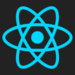

## Minimal ReactJS application
Minimal version of https://github.com/christianalfoni/react-app-boilerplate
that includes CJSX and LESS transformations.

### Install
* Clone this repo
* Install `npm` via your package manager.
* Install `gulp` either via your package manager or by calling `npm install -g gulp`
* Run `npm install`

### Development
* Run `gulp` (or the full path if gulp is not in your shell `PATH`)
* Go to `localhost:8889` to display the app
* The app reloads automatically when the CJSX source files change (via `watchify`)

### Notes
* The web server here is a simple node `connect` instance, actual web applications
are supported by more complex backend code that is beyond the scope of this repo

### Directory
* **app/**: ReactJS application in CJSX
* **build/**: Where your automatically builds to. Includes a static HTML file.
* **styles/**: Where you put your less files
* **gulpfile**: Gulp configuration

### Technologies

